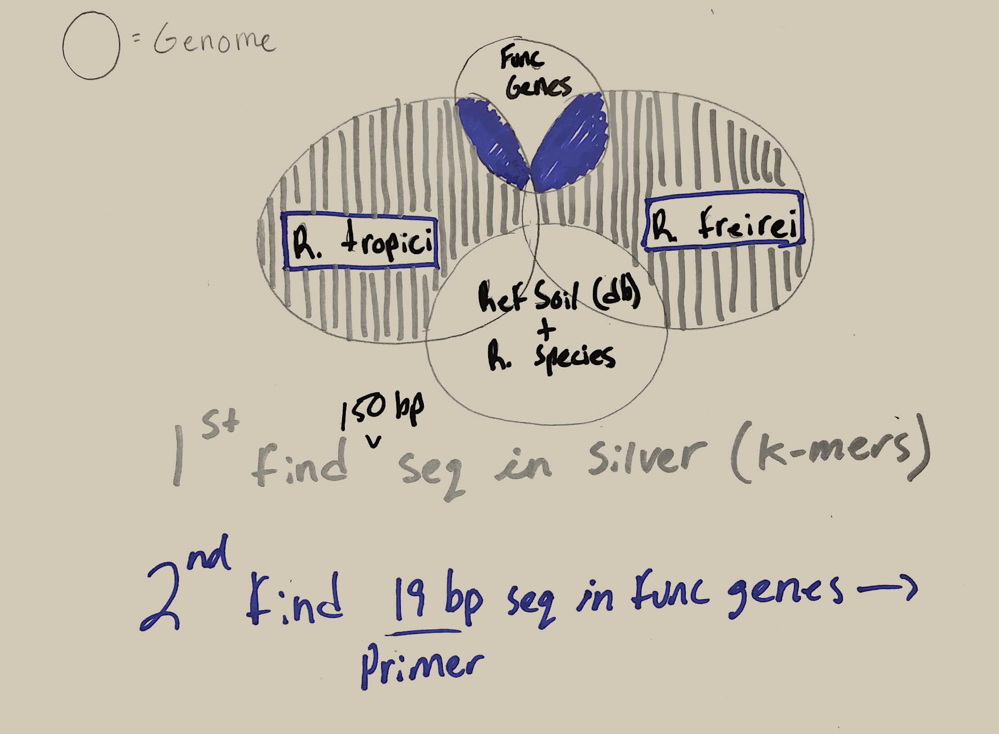

# Identification of primer targets for identifying biomarkers for specific bacteria

###  By Jared Flater in collaboration with Ederson Jesus and Adina Howe


# Inputs: List of accession numbers of targets in Accession_numbers_for_Jared_and_Adina.xlsx
We are interested in IDing unique sequences in G1 and G2 that are not found in other rhizobium species as well as not found in RefSoil db or RefSeq db. Once we have those identified, we will id 19 by seq to target for primer design. 


----

# G1:Rhizobium tropici CIAT 899 (+chromosome) 
1. NC_020059.1+
2. NC_020060.1
3. NC_020061.1
4. NC_020062.1

----

# G2:Rhizobium freirei PRF 81
5. NZ_AQHN01000095.1
6. NZ_AQHN0100009 6.1
7. NZ_AQHN1000084.1 

----

The python script "k-mer.py" is a script that works through refrence and comparison genomes that we choose and finds unique sequnces of lenght k (k-mer) for this script k = 150 bp. 

#  Download RefSoil from https://figshare.com/articles/RefSoil_Database/4362812
----

#  First script in k-mer process:
```{python}
#python k-mer.py [reference1.fa] [comparison1.fa] [comparison.fa] [comparison3.fa] > filename.fa
import screed, sys

#This will consume multiple chromosome genomes into one genome
def consume_genome(fname):
   genome = ''
   for f in fname:
      for record in screed.open(f):
         genome = genome + record.sequence
   return genome

def kmer_count(g, bp):
   f={}
   for x in range(len(g)+1-bp):
      kmer=g[x:x+bp]
      if f.has_key(kmer):
         continue
      else:
         f[kmer]=f.get(kmer,0)+1
   return(f)

def rolling_window(seq, window_size):
   for i in xrange(len(seq) - window_size + 1):
      yield seq[i:i+window_size]

fname = sys.argv[1:2]
fname_compare = sys.argv[2:]


ref_genome1 = consume_genome(fname)
kmer_dict = kmer_count(ref_genome1, 150)
ref_genome2 = consume_genome(fname_compare)

for seq in rolling_window(ref_genome2, 150):
        if kmer_dict.has_key(seq):
                del kmer_dict[seq]

for n, kmer in enumerate(kmer_dict.keys()):
        print ">" + str(n) + "_" + fname[0]
        print kmer
```
# For each file output looks like:
```{bash}
[flaterj1@dev-intel14 K_mers]$ head NZ_mers.fa
>0_refrence_genomes/NZ.fa
TCAGCCAGTCCGATCCAGACTATTACTTCAGCCTGCGTCCCGTGGTCGAAGCCTTCCCCGACGCCCGCGTCATCGCTGCCAGCGCCACCATCGAGGCGATCAAGGCAAATGTGCAGAAGAAGCTCGACACCTGGGGTCCGCAACTCAAGG
>1_refrence_genomes/NZ.fa
GATGGGCGAAACCGCGGCGGATTATCTCGCCGTCAACATGGGGCTTGGCCTTACGCTGACGTCGCTCGCCATGGCCGTAGTGCTTGTCGGTGTGCTTGCGATCCAGTTTCTGCAGGAGCGCTACGTTCCTTGGGCTTATTGGATCGCCGT
>2_refrence_genomes/NZ.fa
GCGATCACCCGGTGAAGCCTTGAGATGCGAGATCAGCACCGTGATGACGAAACCATCGATATCACGCGAAAATCGGAAGCCGTGATTGAGGCGTGGCGGCACCGTAATGATCGCGGGTGGGGTGATGGCGTGAGGAGTTCCGTCAAAGAT
>3_refrence_genomes/NZ.fa
TCATGATGGCGGCTGCGGTGGTGCGTGGCTCGTCGGCCCAGACATAGCCGACCATCAGCGATGCATCCCAGACGCCATCGATGGCGTCGATCCCGGGCAGCATGTCGTAGAGGCCCTTGGCTGGTTCATCGACCGTGCTGGTGCGTTCGC
>4_refrence_genomes/NZ.fa
ACTATGGCCTTGCACCGGGCAAGGACGAGAAGCCCGGTCTCTGGCTGGTTGGAGACCAAGGGATCTACGTCATGTCGAATGGAAGGCTGCGATCAGACGCCAGACCACTCGTGGTCTATGCGGAGGAATGCGATCCGCGCATAGGCGGCG
```
# Example shell commands and file names for first script:
----
Find k-mers in r.freire
```{bash}
python k-mer.py refrence_genomes/NZ_AQHN01000095.1.fa refrence_genomes/NZ_AQHN01000096.1.fa refrence_genomes/NC*.fa compare_genomes/*.fa > r.freirei.mers.fa
```
Find k-mers in r.tropici
```{bash}
phython k-mer.py refrence_genomes/NC_02006*.fa refrence_genomes/NC_020059.1.fa refrence_genomes/NZ*.fa compare_genomes/*.fa > r.tropici.mers.fa
```
# Now we will move onto the second script in the process, finding primers for each k-mer:
```{bash}
#python pri-mer.py
#use this to find unique ends of kmers

import screed, sys

#Breaks down a sequence input into corresponding k-mers
def rolling_window(seq, window_size):
   for i in xrange(len(seq) - window_size + 1):
      yield seq[i:i+window_size]


#Make fname be first and last 19 bp 
for record in screed.open(sys.argv[1]): #reading in your kmer file
   my_seq = record.sequence
   #print my_seq
   for n, x in enumerate(rolling_window(my_seq, 19)):
      if n == 0:
         print ">" + str(n) + "_" + record.name + "_forward"
         print x
      if n == 131:
         print ">" + str(n) + "_" + record.name + "_reverse"
         print x
```
# This is the output from pri-mer.py on test_NZ_mers.fa
```{bash}
[flaterj1@dev-intel14 Scripts]$ python pri-mer.py ../test/test_NZ_mers.fa
>0_0_refrence_genomes/NZ.fa_forward
TCAGCCAGTCCGATCCAGA
>131_0_refrence_genomes/NZ.fa_reverse
TGGGGTCCGCAACTCAAGG
>0_1_refrence_genomes/NZ.fa_forward
GATGGGCGAAACCGCGGCG
>131_1_refrence_genomes/NZ.fa_reverse
GGGCTTATTGGATCGCCGT
>0_2_refrence_genomes/NZ.fa_forward
GCGATCACCCGGTGAAGCC
>131_2_refrence_genomes/NZ.fa_reverse
GAGGAGTTCCGTCAAAGAT
>0_3_refrence_genomes/NZ.fa_forward
TCATGATGGCGGCTGCGGT
>131_3_refrence_genomes/NZ.fa_reverse
ACCGTGCTGGTGCGTTCGC
>0_4_refrence_genomes/NZ.fa_forward
ACTATGGCCTTGCACCGGG
>131_4_refrence_genomes/NZ.fa_reverse
GATCCGCGCATAGGCGGCG
```
# Now we need to get the "body" out of each k-mer (the middle is 112 bp, 150 total bp minus the two 19 bp ends)
# For this, use body.py
```{python}
#python body.py
#use this to feed the body (150-(19*2))bp into a body.fa. We need to make sure no primers match any portion of the k-mer. In addtion, we also include this with all other .fa files we are comparing to.

import screed, sys

#Breaks down a sequence input into corresponding k-mers
def rolling_window(seq, window_size):
   for i in xrange(len(seq) - window_size + 1):
      yield seq[i:i+window_size]

#exclude first and last 19 bp (future primer) collect only center of 150 bp sequence
for record in screed.open(sys.argv[1]):
   my_seq = record.sequence
   for n, x in enumerate(rolling_window(my_seq, 112)):
      if n == 19:
         print ">" + str(n) + "_" + record.name
         print x
```
# This is what the output of body.py looks like:
```{bash}
[flaterj1@dev-intel14 Scripts]$ python body.py ../test/test_NZ_mers.fa
>19_0_refrence_genomes/NZ.fa
CTATTACTTCAGCCTGCGTCCCGTGGTCGAAGCCTTCCCCGACGCCCGCGTCATCGCTGCCAGCGCCACCATCGAGGCGATCAAGGCAAATGTGCAGAAGAAGCTCGACACC
>19_1_refrence_genomes/NZ.fa
GATTATCTCGCCGTCAACATGGGGCTTGGCCTTACGCTGACGTCGCTCGCCATGGCCGTAGTGCTTGTCGGTGTGCTTGCGATCCAGTTTCTGCAGGAGCGCTACGTTCCTT
>19_2_refrence_genomes/NZ.fa
TTGAGATGCGAGATCAGCACCGTGATGACGAAACCATCGATATCACGCGAAAATCGGAAGCCGTGATTGAGGCGTGGCGGCACCGTAATGATCGCGGGTGGGGTGATGGCGT
>19_3_refrence_genomes/NZ.fa
GGTGCGTGGCTCGTCGGCCCAGACATAGCCGACCATCAGCGATGCATCCCAGACGCCATCGATGGCGTCGATCCCGGGCAGCATGTCGTAGAGGCCCTTGGCTGGTTCATCG
>19_4_refrence_genomes/NZ.fa
CAAGGACGAGAAGCCCGGTCTCTGGCTGGTTGGAGACCAAGGGATCTACGTCATGTCGAATGGAAGGCTGCGATCAGACGCCAGACCACTCGTGGTCTATGCGGAGGAATGC
```
# if we paste the k-mer, primer, and body into text edit, we can see that everything lines up how would like it to :
```{bash}
K-mer: >0_refrence_genomes/NZ.fa: 
TCAGCCAGTCCGATCCAGACTATTACTTCAGCCTGCGTCCCGTGGTCGAAGCCTTCCCCGACGCCCGCGTCATCGCTGCCAGCGCCACCATCGAGGCGATCAAGGCAAATGTGCAGAAGAAGCTCGACACCTGGGGTCCGCAACTCAAGG
primer:>0_0_refrence_genomes/NZ.fa_forward                                                                                          >131_0_refrence_genomes/NZ.fa_reverse
TCAGCCAGTCCGATCCAGA                                                                                                                TGGGGTCCGCAACTCAAGG
body:              CTATTACTTCAGCCTGCGTCCCGTGGTCGAAGCCTTCCCCGACGCCCGCGTCATCGCTGCCAGCGCCACCATCGAGGCGATCAAGGCAAATGTGCAGAAGAAGCTCGACACC
```
```{python}
#python k-mer.py [primer.fa] [comparison1.fa] [comparison.fa] [comparison3.fa] > filename.fa

#Need to take in primers forward and back, and validate them by making sure they do not appear in know genomes of non-target organisms. 

import screed, sys

def make_kmer_dict(fname):
   d = {}
   for f in fname:
       for record in screed.open(f):
	   if d.has_key(record.sequence):
   	       d[record.sequence].append(record.name)
	   else:
               d[record.sequence] = [record.name]
   return d

#makes dictionary of all k-mers in a sequence that are present
def kmer_count(g, bp):
   f={}
   for x in range(len(g)+1-bp):
      kmer=g[x:x+bp]
      if f.has_key(kmer):
         continue
      else:
         f[kmer]=f.get(kmer,0)+1
   return(f)

#breaks a sequence into its respective k-mers
def rolling_window(seq, window_size):
   for i in xrange(len(seq) - window_size + 1):
      yield seq[i:i+window_size]

fname = sys.argv[1:2]
fname_compare = sys.argv[2:]

kmer_dict = make_kmer_dict(fname)
#put consume_genome
#kmer_dict is a dictionary of all 19-mers in fnames
ref_genome2 = consume_genome(fname_compare)
#breakdown fname_compare into 19-mers
for seq in rolling_window(ref_genome2, 19):
        if kmer_dict.has_key(seq):
        	continue
	else:
		print ">"+kmer_dict[seq][0]
		print seq
#for record in screed.open(sys.argv[1]):
#        y = record.name

#for n, kmer in enumerate(kmer_dict.keys()):
#        print ">" + str(n) + "_" + fname[0]
#        print kmer
```
# At this point we still need some test files to fully analyze this pipeline.
# Need: comparison genomes, refsoil, body
# Create: test file that is a copy of each of the above, but contains one primer. 
# This will serve as a false positive. 

